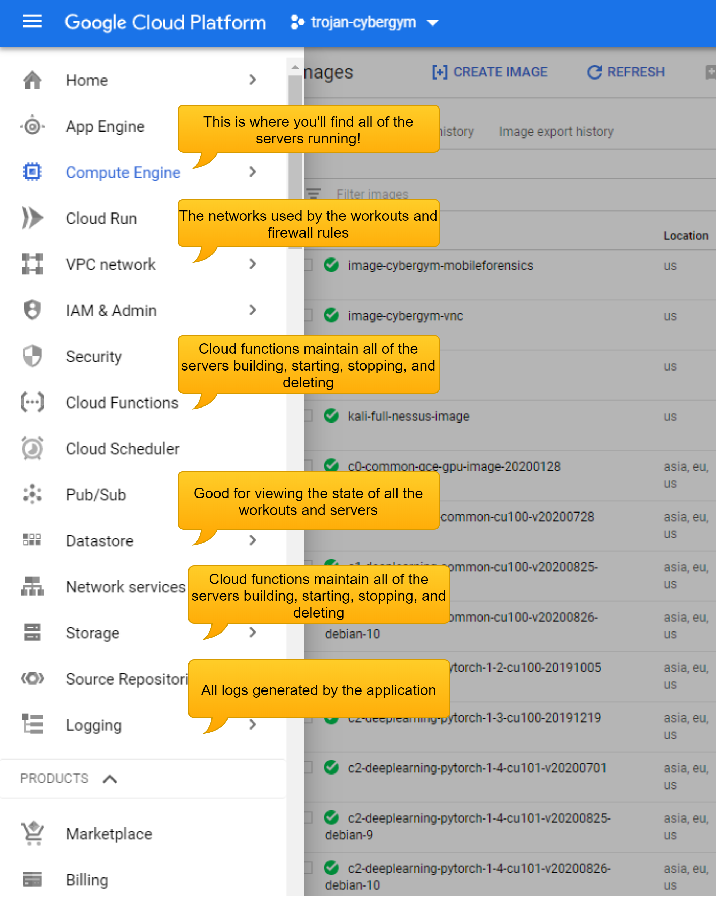
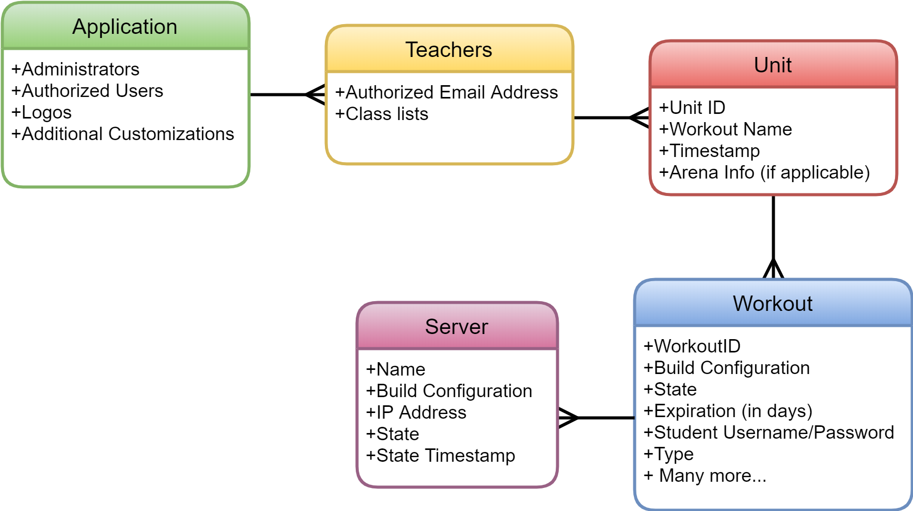
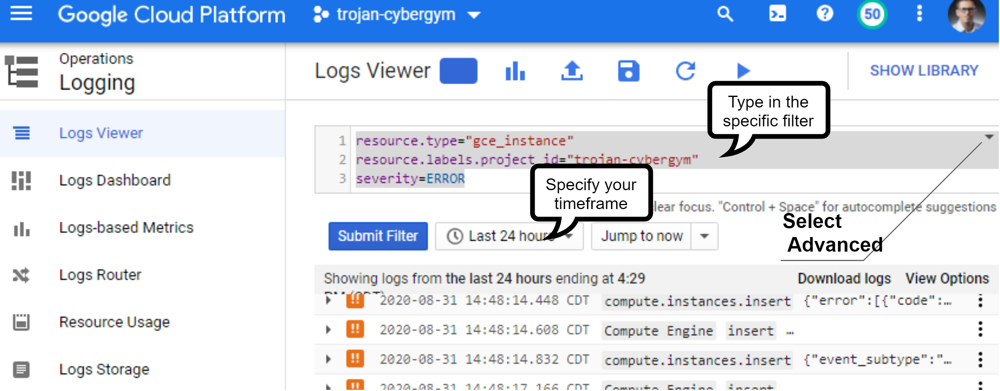

# Administrator's Guide
This guide provides an overview of the UA Little Rock Cyber Gym infrastructure for individuals responsible for the administration, maintenance, and support of a Cyber Gym deployment.

## Where is Everything?

There are a lot of components working together in the project. This section describes the 6 most relevant components needed for administration. Finding these are a lot easier if you pin them to your personal menu.

1.  **Compute Engine -** This is where you will find the actual servers running. Each workout or arena has a workout ID prefix used for tracking the servers. You can manually troubleshoot these servers, but avoid starting and stopping from the cloud. Some servers have DNS records that need to be managed.

2.  **VPC Network** - It’s rare you need to do anything in this section, but the networks, routes, and firewall rules get created here. You can sometimes identify build issues here, but it’s best to check the log files first.

3.  **Cloud Functions** - All of the management of resources takes place with these cloud functions. Most of these get called through pub/sub functions triggered by the main application or the cloud scheduler. You can quickly see if any of these have failed or check the log sources, but it’s best to just go directly to the logs section first.

4.  **Datastore -** The heart of the application! Here, you will find the state of each workout and each server. This is usually one of the first places to look. You can also set workouts that have not fully built as misfits by setting the misfit field in the workout to True. There is a cloud function to delete misfit workouts.

5.  **Storage** – The cloud bucket storage contains build YAML specifications, startup scripts, and instruction pdfs for the workouts.

6.  **Logging** - This is one of the first places to look for issues. See the section below on some logging guidance.

## The State of Things

The datastore is the heart of the application. All data necessary for the application to run is stored here, and this section describes the datastore at a high level to assist in administering the system.

### Data Model

The data model comprises the following objects. Each of these can be filtered and queried through the Datastore Entities GCP application

The following list provides guidance on what to look for when administering the system.

*   **Application** - Check to see if the administrators and authorized users list is correct. This can also be managed through the admin page of the application.

*   **Teachers** - Find class lists for a given teacher. You can also associate units to teachers.

*   **Unit -** This object represents a single workout build for a classroom. All workouts belong to a unit, and instructors can manage all workouts for a given class through the unit. It’s common for teachers to have multiple units throughout the semester. For arenas, the build configuration for the arena is maintained inside the unit

*   **Workout** - Describes a specific workout for an individual student. Here is the first place you can find “state”. State is maintained throughout the build and management of the workout. You can query a workout to find its state.

*   **Server** - The server represents the smallest managed component of the workout. These are managed individually because they take so long to start and stop, and the application kicks these off to multi-threaded cloud functions to build separately. A server object also has the very important property of “state”, which helps administrators identify any builds which may be incomplete.

## Log Review

The cloud logs will usually be the first and most specific indicator of a problem. This section describes some of the more useful log filters for quickly finding issues. The figure below shows where to find the log viewer and how to apply the advanced filter. Once you click “Logs Viewer”, click the dropdown for an advanced filter. Then copy in one of the filters below or use basic mode and only look at the cloud function logs.

<table data-layout="default"><colgroup><col style="width: 136.0px;"><col style="width: 368.0px;"><col style="width: 253.0px;"></colgroup>

<tbody>

<tr>

<th>

**Logs**

</th>

<th>

**How to Filter**

</th>

<th>

**What to look for**

</th>

</tr>

<tr>

<td>

Compute errors

</td>

<td>

Use advanced and paste in the following:

`resource.type="gce_instance"`  
`severity=ERROR`

</td>

<td>

The type of error occurring. If you want to make sure things are successfully built, you can remove the severity filter.

</td>

</tr>

<tr>

<td>

Build debug messages

</td>

<td>

Use advanced and paste in the following:

`resource.type="cloud_function"`  
`severity=DEBUG OR severity=INFO`

</td>

<td>

The build process gives several indicators for the process as its building. Also, it’s helpful to filter out the error messages.

</td>

</tr>

<tr>

<td>

Main Application

</td>

<td>

You can use the basic filter and select Cloud Run Revision → cybergym

</td>

<td>

This shows all web logs, and you may want to use an advanced filter on httpRequest.status.

</td>

</tr>

</tbody>

</table>

## Creating and Using YAML Specifications

Workouts and arenas are built using a YAML specification. You can find the details of the YAML file in the main user guide. The step by step process to build a new YAML includes the following steps:

1.  Upload the YAML to the cloud bucket _**$project**__cloudbuild → yaml-build-files folder.

2.  Navigate to [https://cybergym](https://cybergym)[**$dns_suffix**]/[YAML file you just built]

3.  The URL path will have the YAML to pull for the build. Then you provide the number of students and length of time for availability and click to submit to build the unit.

## Cloud Quotas

Google will limit new projects to a specified number of resources. The README file for the UA Little Rock Cyber Gym project provides recommended values, but then you may have to negotiate with Google to justify the need. Quota errors can be difficult to detect. The best way to find them is to look at the **<u>Quotas</u>** page under the component **<u>IAM & Admin</u>**. Then you can identify the specific quota errors in the Compute Errors log file above.

## Common Student Issues

### Guacamole

A lot of user issues have to do with guacamole. First of all, make sure the user has the right credentials and copies and pastes in the password. If they receive a connection error, there is probably a problem with their workout.

Sometimes the user screen shows up at the bottom very small. This can usually be rectified by refreshing the browser. Or you can have them click Ctrl-Alt-Shift and select the drop-down on the far right and select “Settings”. Then click to select their workout ID again. This usually clears the screen issue.
